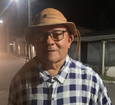

# Cordéis do Poeta Manoel

  
  
  **Acervo digital de Cordéis do Poeta Manoel Ribeiro**
  
  🌐 **[cordeis.gosoares.com](https://cordeis.gosoares.com)**
  
  
  [99917--2122-25D366?style=flat&logo=whatsapp)](https://wa.me/5583999172122)

## Sobre a Coleção

Este repositório contém mais de 40 cordéis do poeta paraibano **Manoel Ribeiro**, organizados em um site estático moderno que preserva e divulga a rica tradição da literatura de cordel nordestina. Cada cordel está disponível tanto em formato web quanto em PDF para impressão.

### Temas Abordados
- 🏛️ **História local**: Lucena, Paraíba e região nordeste
- 🐋 **Cultura marítima**: Pesca da baleia na Copesbra, tradições pesqueiras
- 📚 **Memórias pessoais**: Infância, família e experiências de vida
- 🎭 **Folclore brasileiro**: Lendas, tradições e festividades
- 🗳️ **Crítica social**: Política, educação e questões sociais
- 🎉 **Celebrações**: São João, Natal, festas juninas
- 📖 **Temas educativos**: Geografia, saúde, meio ambiente
- 👥 **Biografias**: Homenagens a personalidades locais

## Sobre o Poeta Manoel Ribeiro

**Manoel Ribeiro** é um poeta popular paraibano, filho de José Ribeiro (Zé Ribeiro), agricultor da região. Nascido na Fazenda Patrocínio, na Paraíba, teve uma infância marcada pelo trabalho no campo e pela perda precoce da mãe, Maria Cardoso, quando tinha apenas 12 anos.

### Trajetória de Vida
- 🌱 **Origens rurais**: Cresceu trabalhando na agricultura e no cultivo de cana-de-açúcar
- 🏭 **Trabalhador da Copesbra**: Atuou na famosa empresa de pesca da baleia em Lucena
- 🎯 **Descoberta tardia**: Encontrou na poesia sua verdadeira vocação após anos de trabalho
- 🌊 **Conexão com Lucena**: Mantém forte ligação com a cidade litorânea e sua comunidade pesqueira
- ✍️ **Poeta autodidata**: Desenvolveu seu talento poético através da observação da vida e da natureza

> *"Sua força vem de uma fonte chamada educação / Que reúne cada palavra que descreve seu coração / Em um oceano vasto de baleia e poesia / Que desaguam nas límpidas águas da plena sabedoria."*

## Características Técnicas

### 🏗️ Arquitetura
- **Hugo Static Site Generator** com tema PaperMod
- **Geração automática de PDFs** usando LaTeX/Pandoc
- **NetlifyCMS** para gerenciamento de conteúdo
- **Deploy containerizado** com Docker e nginx

### 📱 Funcionalidades
- 🔍 **Busca integrada** em todo o acervo
- 📱 **Design responsivo** para todos os dispositivos
- 📄 **PDFs para impressão** de cada cordel
- 🎨 **Capas ilustradas** no estilo xilogravura nordestina
- 📚 **Organização por temas** e data de publicação

### 🛠️ Stack Tecnológica
- **Frontend**: Hugo + PaperMod Theme
- **Geração PDF**: Pandoc + LaTeX
- **CMS**: NetlifyCMS
- **Deploy**: Docker + nginx
- **Hosting**: GitHub Pages

## Cordéis em Destaque

### História e Memória
- 🐋 [História da Copesbra e da baleia](https://cordeis.gosoares.com/cordeis/historia_da_copesbra_e_da_baleia/)
- 🏘️ [Lucena terra amada](https://cordeis.gosoares.com/cordeis/lucena_terra_amada/)
- 👶 [Um pedaço da minha infância](https://cordeis.gosoares.com/cordeis/um_pedaco_da_minha_infancia/)

### Cultura e Tradições
- 🎊 [As tradições do São João](https://cordeis.gosoares.com/cordeis/as_tradicoes_do_sao_joao/)
- 🎄 [Lapinha resgatando nossa cultura](https://cordeis.gosoares.com/cordeis/lapinha_resgatando_nossa_cultura/)
- 🎭 [Lenda Comadre Fulozinha e Tio Pedro](https://cordeis.gosoares.com/cordeis/lenda_comadre_fulozinha_e_tio_pedro/)

### Crítica Social
- 🗳️ [Eleitor abestalhado](https://cordeis.gosoares.com/cordeis/eleitor_abestalhado/)
- 🎓 [Atenção com sua próstata](https://cordeis.gosoares.com/cordeis/atencao_com_sua_prostata/)
- 🌍 [As regiões, as capitais e os estados do Brasil](https://cordeis.gosoares.com/cordeis/as_regioes_as_capitais_e_os_estados_do_brasil/)

## Contato

- 📷 **Instagram**: [@poetamanoeldocordelpb](https://instagram.com/poetamanoeldocordelpb)
- 📱 **WhatsApp**: [(83) 99917-2122](https://wa.me/5583999172122)
- ☎️ **Telefone**: (83) 99917-2122

---

  <em>Preservando a tradição do cordel nordestino através da tecnologia</em>
    
  <a href="https://cordeis.gosoares.com">🌐 Visite o site oficial</a>

